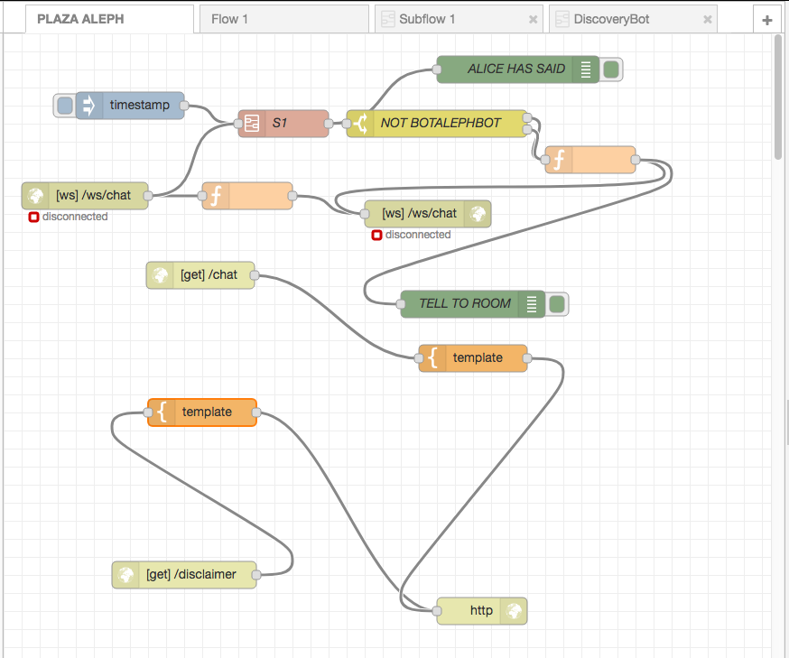
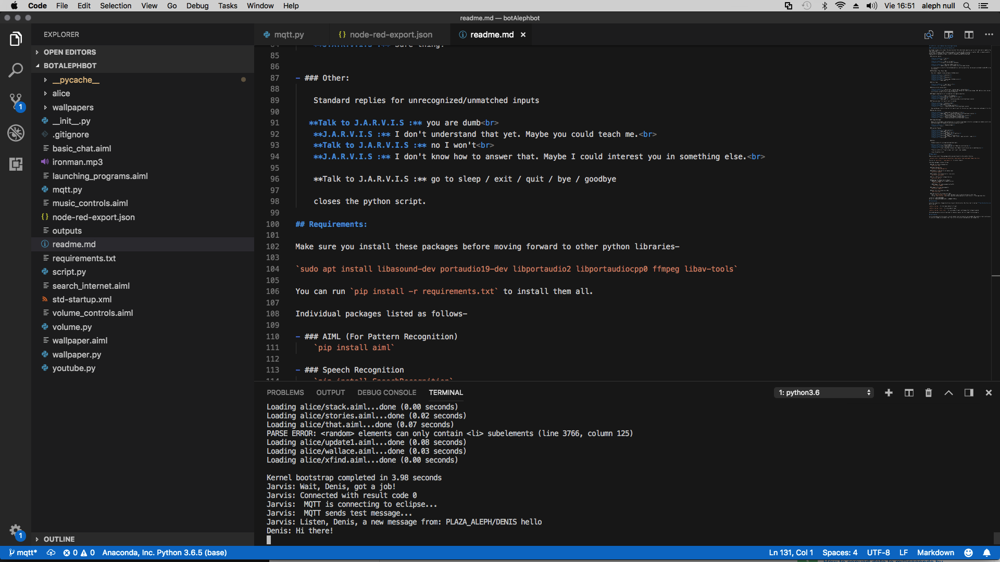
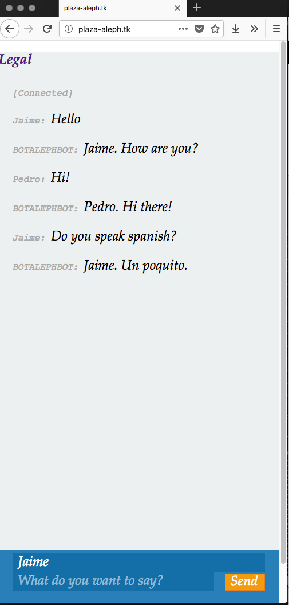

Descripción
=============
Es un bot conversacional.

El motor es J.A.R.V.I.S. (python) y la inteligencia ALICE (aiml). DENIS es un protocolo mqtt para chatear con ALICE.

- J.A.R.V.I.S.: https://github.com/nihal111/J.A.R.V.I.S
- ALICE: https://es.wikipedia.org/wiki/AIML
- DENIS: Demo (NodeJS, Bluemix, Node-Red): http://plaza-aleph.tk/

Detalles de la bifurcación
======================

Respecto de J.A.R.V.I.S., se mantiene la creación del cerebro en el fichero [.script.py](.script.py) para determinar
si es preciso o no cargar el catálogo .aiml de aprendizaje.

Secuencia de arranque del worker Denis, carga de ficheros .aiml:

'''python 

	kernel = aiml.Kernel()

    if os.path.isfile("bot_brain.brn"):
        kernel.bootstrap(brainFile="bot_brain.brn")
    else:
        kernel.bootstrap(learnFiles="std-startup.xml", commands="load aiml b")
        # kernel.saveBrain("bot_brain.brn")
'''

Se han desactivado las funciones locales y el stdIN/OUT queda reemplazado por una subscripción mqtt. Ver detalles
en [./mqtt.py](./mqtt.py).

Secuencia de arranque del cliente mqtt con el que el worker Denis se comunica con las salas de chat:

'''python
	# The callback for when the client receives a CONNACK response from the server.
	def on_connect(self, client, userdata, flags, rc):
		print("Jarvis: Wait, Denis, got a job!")
		print("Jarvis: Connected with result code "+str(rc))

		# Subscribing in on_connect() means that if we lose the connection and
		# reconnect then subscriptions will be renewed.
		#client.subscribe("$SYS/#")
		print("Jarvis:  MQTT is connecting to eclipse...")
		client.subscribe("PLAZA_ALEPH/DENIS/#")
		print("Jarvis:  MQTT sends test message...")
		self.client.publish("PLAZA_ALEPH/DENIS/JARVIS", "Denis & me are back! hello!")		

	# The callback for when a PUBLISH message is received from the server.
	def on_message(self, client, userdata, msg):
		self.in_message(msg.topic, str(msg.payload.decode('UTF-8')))			
	
	def outmessage(self, topic, payload):
		self.client.publish("PLAZA_ALEPH/DENIS_SAYS/" + topic, payload)		

	def start(self, in_message):
		self.in_message = in_message
		self.client.connect("iot.eclipse.org", 1883, 60)
'''

HEROKU VERSION
=============

NOTA: La web se duerme por inactividad. El **primer** acceso la despierta
y tarda considerablemente. Plan Free.

https://denisbot.herokuapp.com/

- Cómo desplegar la aplicación: [Empezando con Python (EN)](https://devcenter.heroku.com/articles/getting-started-with-python#set-up)

- Repositorio: https://git.heroku.com/denisbot.git

Hay dos dynos:

'''
- web: A django web app (See below for link)
- denis: JARVIS doing the Denis background thing

'''

Comando típicos:

- heroku login
- heroku create denis

- git push heroku master
- heroku ps:scale web=1
- heroku ps:scale denis=1
- heroku open
- heroku ps 
- heroku logs -t -p denis

PLAZA ALEPH
===========
La plaza aleph es una sala de chat que usa el protocolo de Denis para contestar a cualquier intervención que se haga
en el chat. Es una implementación IBM Node-Red.

- Editor: https://clanaleph.eu-gb.mybluemix.net/red/
- http://plaza-aleph.thk

Ver detalles:

# Origen del fork:

## J.A.R.V.I.S - Just A Rather Very Intelligent System

#### Created and Tested on Linux with Python 2.7

An attempt to make a very simple, Personal Assistant that understands speech as well as text input and is capable of performing tasks other than conversing.
This project is based on AIML 1.0 and uses pyaiml for using the AIML interpreter in python. AIML, is based on pattern matching and this project does not implement any sort of machine learning or language processing.
Combined with a few python scripts, J.A.R.V.I.S now performs quite a few tasks:

- ### Converses, barely.

    **Talk to J.A.R.V.I.S :** hello 
    **J.A.R.V.I.S :** Well, hello

    **Talk to J.A.R.V.I.S :** Who is iron man? 
    **J.A.R.V.I.S :** Iron man is the one who created me.

    **Talk to J.A.R.V.I.S :** What does JARVIS stand for? 
    **J.A.R.V.I.S :** JARVIS stands for Just A Rather Very Intelligent System

    All conversation is only for the hardcoded patterns, which are quite few. Can be easily extended to add AIML scripts of ALICE and other existing AIs.

- ### Rhythmbox: Play, Pause, Open.

    Uses shell commands to play and pause rhythmbox music.

    **Talk to J.A.R.V.I.S :** play music 
    **J.A.R.V.I.S :** On it! 
    **Talk to J.A.R.V.I.S :** play music 
    **J.A.R.V.I.S :** On it! 
    **Talk to J.A.R.V.I.S :** please open rhythmbox jarvis 
    **J.A.R.V.I.S :** Right away, sir!

- ### Tells time.
    
    **Talk to J.A.R.V.I.S :** what time is it? 
    **J.A.R.V.I.S :** The time is 4 43 am

- ### Gives a brief system status.

    **Talk to J.A.R.V.I.S :** how are you? / System report / System Status 
    **J.A.R.V.I.S :** I am fine, sir. All systems are at 100 percent. Battery percentage: 100%. Battery state: discharging. 265 processes are currently running. Current volume is 30 percent

- ### Suggests Googling for all unrecognized interrogative questions

    **Talk to J.A.R.V.I.S :** What is IIT, Bombay? 
    **J.A.R.V.I.S :** Do you want me to google that for you? 
    **Talk to J.A.R.V.I.S :** yes 
    **J.A.R.V.I.S :** Right away, sir!  Created new window in existing browser session.

- ### Plays any song, first search result in youtube

    **Talk to J.A.R.V.I.S :** play me a song 
    **J.A.R.V.I.S :** What song, sir? 
    **Talk to J.A.R.V.I.S :** Alter Bridge Isolation 
    **J.A.R.V.I.S :** On it!  Created new window in existing browser session.

    Uses youtube.py script to find the first search result for the last user input in above case, and opens it in chromium browser.

- ### Searches internet.

    **Talk to J.A.R.V.I.S :** Google what is the answer to life? 
    **J.A.R.V.I.S :** Right away, sir!  Created new window in existing browser session. 
    **Talk to J.A.R.V.I.S :** Search youtube for Call of Duty 
    **J.A.R.V.I.S :** On it!  Created new window in existing browser session. 
    **Talk to J.A.R.V.I.S :** Search for Navi Mumbai on google maps 
    **J.A.R.V.I.S :** On it!  Created new window in existing browser session.

- ### Changes Wallpaper.

    Keep a set of wallpapers (and nothing else) in J.A.R.V.I.S/wallpapers directory. wallpaper.py randomly selects one and sets it as the desktop wallpaper by changing the key value using dconf-editor.

    **Talk to J.A.R.V.I.S :** change wallpaper 
    **J.A.R.V.I.S :** On it!

- ### Launches Programs.
    
    **Talk to J.A.R.V.I.S :** open nautilus 
    **J.A.R.V.I.S :** Right away, sir! 
    **Talk to J.A.R.V.I.S :** take me to /etc 
    **J.A.R.V.I.S :** Sure thing! (Opens /etc in nautilus) 
    **Talk to J.A.R.V.I.S :** take me home 
    **J.A.R.V.I.S :** Sure thing! (Opens ~ in nautilus) 
    **Talk to J.A.R.V.I.S :** open chromium / open firefox / open calculator / open vlc 
    **J.A.R.V.I.S :** Sure thing!

- ### Other:
    
    Standard replies for unrecognized/unmatched inputs

   **Talk to J.A.R.V.I.S :** you are dumb 
    **J.A.R.V.I.S :** I don't understand that yet. Maybe you could teach me. 
    **Talk to J.A.R.V.I.S :** no I won't 
    **J.A.R.V.I.S :** I don't know how to answer that. Maybe I could interest you in something else. 

    **Talk to J.A.R.V.I.S :** go to sleep / exit / quit / bye / goodbye

    closes the python script.

## Requirements:

Make sure you install these packages before moving forward to other python libraries-

`sudo apt install libasound-dev portaudio19-dev libportaudio2 libportaudiocpp0 ffmpeg libav-tools`

You can run `pip install -r requirements.txt` to install them all.

Individual packages listed as follows-

- ### AIML (For Pattern Recognition)
    `pip install aiml`

- ### Speech Recognition
    `pip install SpeechRecognition`

- ### PyAudio is required for microphone input
    `pip install pyaudio`

- ### alsaaudio: (For Volume Control, Linux only)
    `pip install pyalsaaudio`

- ### ttsx: (Offline Text to Speech Service)
    `pip install pyttsx`

- ### Optional for Google Text to Speech :
   + #### gTTS: (Google Text to Speech service)
      `pip install gTTS`

   + #### PyGame: (For audio playback with gTTS)
       `pip install pygame`

- ### argparse (For parsing arguments)
    `pip install argparse`

## Installation:

Clone this repository. Change directories to go to that directory. Run the script "script.py" **from the directory containing it**.
Run script as:

`python script.py` : for text mode (default) of input

`python script.py --voice` : for voice mode of input

`python script.py --voice --gtts` : for voice mode of input, with Google Text to Speech enabled

Voice mode may give a series of warnings for numerous reasons, but still might fuction properly.

